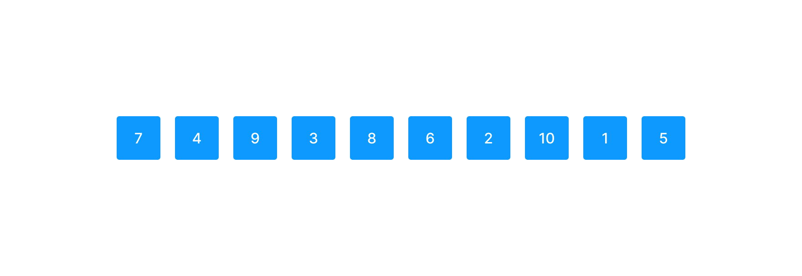
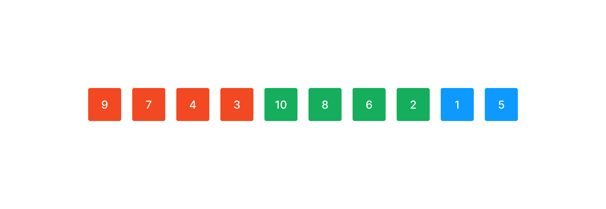
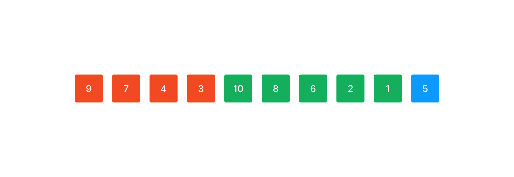
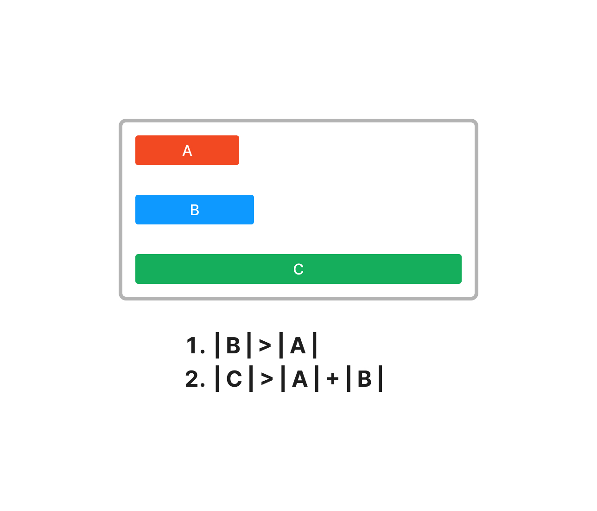
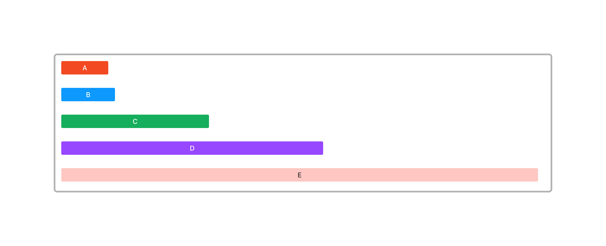
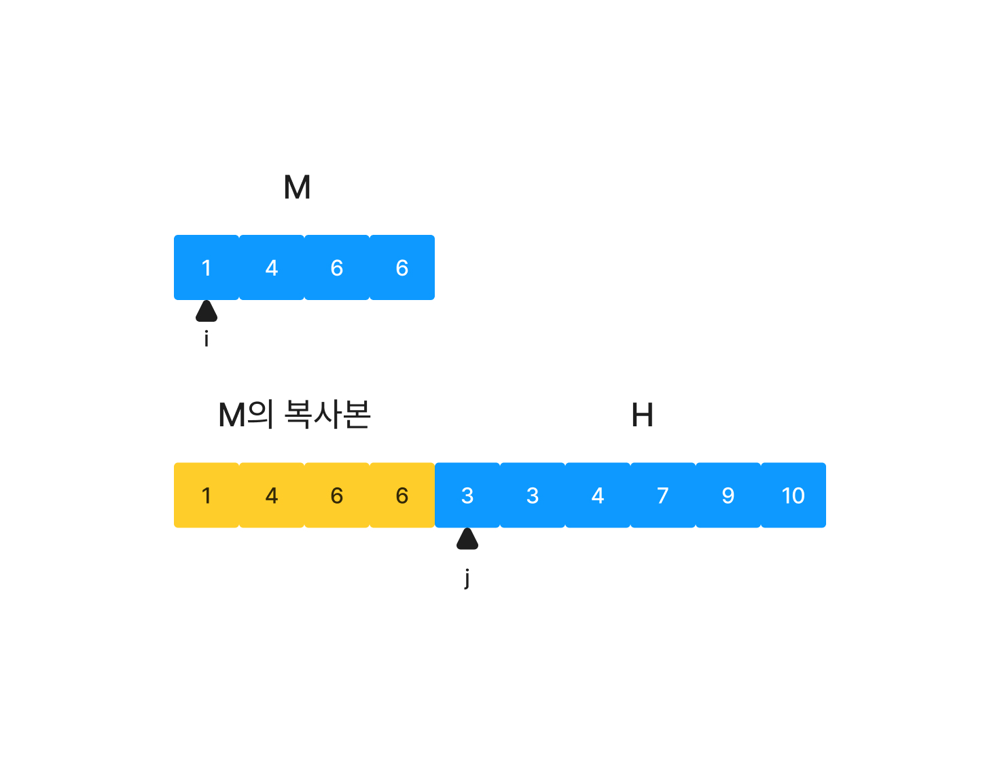
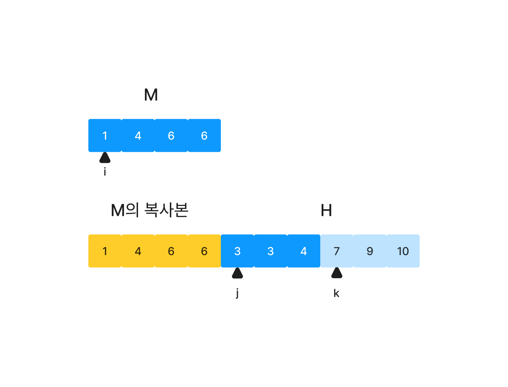

## V8은 정렬 이전과 이후에 무엇을 하는가

V8은 한 개의 전처리 과정과 한 개의 후처리 과정을 거친다. 기본적인 아이디어는 다음과 같다.

> 모든 `undefined` 값들을 임시 list에 모은 뒤, `undefined`가 아닌 값들을 정렬하고 `undefined`를 뒤에 붙인다.

### 전처리 과정

먼저 배열의 값들을 다음과 같이 분류한다.

1. 모든 `undefined`가 아닌 값들(비교 함수에 따라 정렬될 값)
2. 모든 `undefined`값들
3. 모든 빈칸, 즉 존재하지 않는 속성들

실제 정렬 알고리즘은 첫 번째 분류(undefined가 아닌 값)에만 적용되면 된다. 이를 위해서 V8은 다음과 같이 동작하는 전처리 과정을 가진다.

1. 배열을 순회하며
   1. 만약 원소가 hole이다. -> 아무것도 하지 않는다.
   2. 만약 원소가 `undefined`이다. -> `numberOfUndefineds`의 값을 1 증가시킨다.
   3. 둘 다 아니라면 원소를 elements라는 임시 배열에 추가한다.

이 작업이 이루어지면, 모든 `undefined`가 아닌 값들은 `elements`라는 임시 배열에 담기게 된다. `undefined`들은 개수만 알면 된다. 자바스크립트 sort의 명세에 따르면 `undefined` 들이 맨 끝에 정렬되어야한다. `undefined` 값들은 실제로 유저가 제공한 비교 함수에 전달되지 않을 것이기 때문에 `undefined`가 등장한 횟수만 새면 된다.

다음으로 `elements` 배열을 실제로 정렬한다. 글의 후반부 TimSort 섹션에서 자세한 내용을 다룬다.

### 후처리 과정

전처리를 거치고 얻은 정렬된 값들을 원본 배열 혹은 객체에 덮어써야 한다. 후처리 과정은 다시 세 단계로 구성된다.

1. 원본 객체의 앞부터 `elements` 배열로 덮어쓴다.
2. 그 뒤를 `numberOfUndefineds` 값만큼 `undefined`로 채운다.
3. 나머지 값들은 삭제한다.

3번 과정은 정렬하려는 원본 객체에 hole이 포함된 경우에 필요하다. 3번을 하지 않으면 배열에 중복된 값이 생길 수 있다.

## 과거의 정렬 방식 (QuickSort)

`Array.prototype.sort` 와 `TypedArray.prototype.sort` 는 자바스크립트로 구현된 Quicksort 구현체에 의존했었다. 정렬 알고리즘 다소 단순하다: 기본적으로는 Quicksort를 하지만, 길이가 짧은 배열(length < 10)에 대해서는 삽입 정렬을 사용한다. Quicksort 재귀 중 하위 배열의 길이가 10에 도달하면 삽입 정렬로 대체된다. 작은 배열에 대해서는 삽입 정렬이 더 효율적인데, 이는 Quicksort가 분할 이후 재귀적으로 두 번 호출되기 때문이다. 각 재귀 호출은 스택 프레임을 생성하고(그리고 제거하는) 오버헤드가 있다.

Quicksort에서 적절한 pivot을 선택하는 것은 성능에 큰 영향을 준다. V8은 2가지 전략을 채택했다.

- 피봇은 정렬될 배열의 첫 번째, 마지막 그리고 third-element 중 중앙값으로 선택되었다. 작은 배열의 경우 third-element는 단순히 배열의 중간 요소로 선정했다.
- 큰 배열에선 표본을 추출하고, 표본을 정렬한 뒤, 정렬된 표본의 중앙값을 위 계산의 third-element로 사용했다.

퀵소트의 이점 중 하나는 in-place 정렬을 한다(혹은 그렇게 구현할 수 있다)는 것이다. 메모리 오버헤드는 큰 배열을 정렬할 때 표본을 저장하기 위한 작은 배열 할당과 log(n)의 스택 영역 할당뿐이다. 단점은 안정정렬이 아니라는 점과 QuickSort는 최악의 상황에 O(n^2)의 성능을 보인다는 점이다. 즉, 안정적이지 않았다.

## 현재의 정렬 방식 (Timsort)

2002년 파이썬에 탑재하기 위해 Tim Peter가 개발한 **Timsort**는 Merge sort와 Insertion sort를 기반으로 다양한 최적화 기법을 적용한 정렬이다. 현재는 Python, V8, Swift, Java SE 7 등 다양한 언어에서 채택되었다.

기본적인 아이디어는 다음과 같다.

> 연속적으로 정렬된 부분을 "run"이라고 하자.
>
> 대부분의 현실 세계 데이터에는 이미 자연적으로 생긴 run들이 포함되어 있다.
> 이 run들을 이용하면 비교와 swap 비용을 줄일 수 있다.
>
> 따라서 이 run들을 최대한 활용해 보자!

### run이란 무엇인가?

run은 배열 내에 자연적으로 발생한 연속 정렬된 부분 수열이다.

_랜덤한 배열_

위와 같이 10개 원소를 가진 배열이 있다고 하자.


위의 배열에서 run을 찾으면 (7,4) (9,3) (8,6,2) (10,1) (5)이 있다.

run은 마지막 원소가 run이 되는 경우를 제외하고는 항상 길이가 2보다 길다.

run은 증가하는 경우와 감소하는 경우 둘 다 상관없다. 배열을 증가하도록 정렬할 때 감소하는 run은 단순히 뒤집기만 하면 증가하는 run으로 만들 수 있기 때문이다.
run을 뒤집을 때는 양 끝값을 서로 swap하며 중앙으로 수렴하는 방식을 이용한다. 이때 stable을 지키기 위해 두 값을 비교해 한쪽이 엄격하게 작은 경우에만 swap한다.

```js
funciton reverseRun(arr) {
  const middle = Math.floor(arr.length / 2)

  for(let i=0;i<middle;i++) {
    if(arr[i] === arr[arr.length-i-1]) {
      // arr는 어느 방향으로든 정렬이 되어있기 때문에 swap할 두 값의 값이 같다면
      // 더 이상 swap을 할 필요가 없다.
      break;
    }

    const temp = arr[i];
    arr[i] = arr[arr.length-i-1];
    arr[arr.length-i-1] = temp;
  }
}
```

### 알고리즘 (simple)

알고리즘의 순서는 다음과 같다.

1. minrun의 길이를 결정한다.
2. 배열을 minrun을 기준으로 잘라 run을 만든다.
3. run을 병합한다. (1개의 배열이 될 때까지 반복한다)

### minrun의 크기를 결정하는 방식

run의 크기는 배열의 길이에 따라 유동적으로 결정된다.

배열의 원소 수를 N이라고 하자. minrun이 될 수 있는 최대 값을 MAX_MINRUN이라고 하겠다.
N < MAX_MINRUN이라면 minrun값은 N이 된다. 즉, run을 나누지 않는다. 대신 배열을 binary insertion sort한다. 앞서 언급했듯, 작은 배열에선 삽입정렬이 더 효율적이기 때문이다.

Merge Sort에선 Merge(병합)해야하는 배열의 수가 2의 거듭제곱 (2^x)일때 가장 효율적이다.
그럴 수 없다면 2의 거듭제곱보다 조금 적을 때 효과적이다. 가장 최악은 2의 거듭제곱보다 조금 더 많은 경우이다.

따라서 run의 수가 2의 거듭제곱이 될 수 있게 minrun의 길이를 결정하는 것이 좋다.

예를 들어보자, N=2112, run의 길이는 32라고 하자.
run의 개수는 2112/32 = 66개가 나온다.

66개의 run들을 병합하는 과정을 보자. 각 병합에는 최악의 경우 `2 * (run의 길이) - 1` 번의 비교가 일어난다. 최악의 경우를 따져보자.

1. 32길이의 run을 33번 병합해야 한다. 63 \* 33번의 비교가 발생했다. (64길이 33개의 run이 남았다)
2. 64길이의 run을 16번 병합해야 한다. 127 \* 16번의 비교가 발생했다. (128길이 16개, 64길이 1개의 run이 남았다)
3. 128길이의 run과 64길이의 run을 병합한다. 128 + 64 - 1번의 비교가 발생했다. (128길이 15개, 192길이 1개의 run이 남았다)
4. 128길이의 run을 7번 병합해야 한다. 255 \* 7번의 비교가 발생했다. (256길이 7개, 192길이 1개, 128길이 1개의 run이 남았다)
5. 192길이의 run 1개와 128길이의 run을 병합한다. 192 + 128 - 1번의 비교가 발생했다. (256길이 7개, 320길이 1개의 run이 남았다)
6. 256길이의 run을 3번 병합해야 한다. 511 \* 3번의 비교가 발생했다. (512길이 3개, 320길이 1개, 256길이 1개의 run이 남았다)
7. 320길이의 run 1개와 256길이의 run을 병합한다. 320 + 256 - 1번의 비교가 발생했다. (512길이 3개, 576길이 1개의 run이 남았다)
8. 512길이의 run을 1번 병합해야 한다. 1023번의 비교가 발생했다. (1024길이 1개, 576길이 1개, 512길이 1개의 run이 남았다)
9. 576길이의 run 1개와 512길이의 run을 병합한다. 1088번의 비교가 발생했다. (1088길이 1개, 1024길이 1개의 run이 남았다)
10. 1088길이의 run 1개와 1024길이의 run을 병합한다. 2111번의 비교가 발생했다. (병합 완료)

모두 **12736**번의 비교가 발생한다.

하지만 run의 길이가 33이라면 어떨까?
run의 개수는 2112/33 = 64개가 나온다.

같은 방식으로 병합을 진행해 보자.

1. 33길이의 run을 32번 병합해야 한다. 65 \* 32번의 비교가 발생했다.
2. 66길이의 run을 16번 병합해야 한다. 131 \* 16번의 비교가 발생했다.
3. 132길이의 run을 8번 병합해야 한다. 263 \* 8번의 비교가 발생했다.
4. 264길이의 run을 4번 병합해야 한다. 527 \* 4번의 비교가 발생했다.
5. 528길이의 run을 2번 병합해야 한다. 1055 \* 2번의 비교가 발생했다.
6. 1056길이의 run을 1번 병합해야 한다. 2111 \* 1번의 비교가 발생했다.

모두 **12609**번의 비교가 발생한다.

즉, run의 길이가 길어지더라도 run의 개수가 2의 거듭제곱과 일치하면 더 적은 비교가 발생한다.
run의 개수가 2의 거듭제곱보다 조금 많을 때 최악의 경우가 발생한다.

> run의 개수가 2의 거듭제곱과 같다면 효율적이다.
> run의 개수가 2의 거듭제곱보다 조금 클 때 비효율적이다.

따라서 N / minrun이 2의 거듭제곱이 되는 minrun을 선택하고, 그런 minrun을 선택할 수 없다면 2의 거듭제곱에 가깝지만 엄격하게 2의 거듭제곱보다 작아지도록 `MAX_MINRUN / 2 ~ MAX_MINRUN` 사이의 값 중에서 minrun을 선택한다.
예를 들어 MAX_MINRUN이 64라면 32 ~ 64중에 minrun을 선택한다.

Timsort에선 실제로 MAX_MINRUN을 64로 잡는다. MAX_MINRUN이 8이면 함수 호출이 너무 많아 오버헤드가 더 크고 256이면 binary insertion sort가 느려 마찬가지로 영향을 주는 것을 확인했고, 최종적으로 32를 최적이라 생각했지만, 2112길이의 배열 예시처럼 2의 거듭제곱을 만들 수 있도록 32보다 큰 값을 허용하는 것이 좋다고 판단했기 때문이다.

### Insertion sort를 이용하는 이유

Insertion sort(삽입 정렬)는 언뜻 보면 n^2의 시간복잡도를 가져 느리다고 생각할 수 있다. 하지만 앞서 Quicksort에서 설명했듯, 작은 길이 배열에 대해선 2번의 재귀 호출이 일어나는 Merge Sort보다 참조 지역성 원리의 수혜를 아주 잘 누리는 Insertion sort가 더 효율적이다.

특히 배열이 이미 어느 정도 정렬되어 있으면 Insertion Sort는 더욱 효과적으로 된다. Insertion Sort는 최선의 경우 O(n)만큼의 복잡도를 갖기 때문이다.

여기에 Binary Insertion sort를 사용하면 원소가 삽입될 위치를 O(nlogn)만에 찾도록 더 최적화할 수 있다.

### minrun를 기준으로 run 만들기

주어진 배열의 길이로부터 minrun을 결정했다. 이제 minrun에 맞춰 배열을 자른다.
앞서 minrun은 32~64 사이의 값을 사용한다고 했지만, 이해를 위해 minrun의 값을 4로 잡자.


먼저 감소하는 부분수열 (7,4)를 찾았다. 하지만 minrun의 길이 4보다 짧기 때문에 뒤의 2개 수를 더 포함해 Binary Insertion Sort를 수행한다.


이로써 minrun을 만족하는 첫 번째 run을 만들었다.
다음 run을 만들어보자.


마찬가지로 감소하는 길이 3인 부분 수열 (8,6,2)를 찾았다. 마지막 원소를 추가해 Binary Insertion Sort를 수행한다.



2번째로 생성한 run은 minrun 길이는 만족했지만, run은 길수록 좋다. 따라서 뒤에 붙은 원소들을 포함해도 감소/증가하는 부분 수열임을 만족한다면 생성한 run에 추가한다.

앞선 run에선 (10)을 포함할 수 없었다. 감소하는 run이었기 때문이다.
이번 run에선 뒤의 원소 (1)을 붙여도 여전히 감소하는 부분 수열을 만족하기 때문에 (1)을 run에 추가한다.



마지막 원소는 합칠 수 있는 원소가 더 이상 없기 때문에 그 자체로 run이 된다.


이렇게 해서 배열은 마지막 run을 제외하고 minrun과 같거나 더 긴 run들로 구성되었다.
이제 이들을 merge하면 된다.

여기서 잠깐, 눈치 챘는지 모르겠지만, TimSort는 일반적인 MergeSort와 달리 재귀가 아닌 반복문을 이용해 구현한다. run을 생성하는 과정은 반복문이 이용된다. 이 덕분에 call stack overflow가 발생하지 않는 점도 최적화 포인트이다.

### run을 병합하기

Merge Sort는 병합할 때 비슷한 길이의 두 배열을 Merge하는 것이 더 효율적이다.

길이 m,h인 두 배열을 Merge할 때 최악의 경우 두 배열을 모두 순회하며 비교해야하기 때문에 m+h-1 만큼의 비용이 든다.


5개의 원소를 병합하는 과정을 거칠 때를 예로 들어 보자. 앞의 배열부터 순서대로 병합을 진행한다고 하자. 이렇게 되면 큰 배열과 작은 배열을 연속적으로 병합하는 형태가 될 것이다.
이때 5개의 원소를 모두 병합하는데 들어가는 비용은 1 + 2 + 3 + 4 = 10이다.

반면 작은 길이 배열을 먼저 병합하는 경우 모든 원소를 병합하는 비용은 1 + 1 + 2 + 4 = 8이다.

> 비슷한 길이의 두 배열을 Merge하는 것이 더 효율적이다.

따라서 Timsort도 비슷한 길이의 배열을 merge할 수 있도록 다음의 방식으로 run들을 병합한다.



run을 생성할 때마다 Stack에 추가한다.

1. 스택의 상위 3개 run을 확인한다. 각각 A, B, C라고 하겠다.
2. 각 run의 길이는 |A|,|B|,|C|라고 하겠다.
3. 다음의 조건을 만족하지 않으면 B를 A와 C 중 짧은 쪽과 병합한다.
   1. |B|가 |A|보다 길다.
   2. |C|가 |A| + |B| 보다 길다.
4. 조건을 만족할 때까지 2를 반복한다.

이렇게 하면 결과적으로 다음과 같은 Stack을 얻을 수 있다.



- A + B < C
- B + C < D
- C + D < E

이 스택은 마치 피보나치의 수처럼 생겼다.

이 스택을 위에서부터 순서대로 병합을 하면 비슷한 길이의 run들을 병합할 수 있다.
또한 스택에 원소들을 적게 유지할 수 있다. 피보나치의 수를 1부터 38까지 전부 더하면 1억을 좀 넘는 값이 나온다. 즉, 이러한 형태의 스택은 1억 개가 넘는 원소를 스택에 38개의 원소로 담고 있을 수 있다.

### run 병합 최적화하기 - 메모리 최적화

길이가 m,h인 두 run M,H를 병합할 때 우리는 (m+h)\*2만큼의 메모리가 필요하다는 것을 알고 있다.
하지만 실은 간단한 최적화를 통해 2m + h (m < h)만큼의 메모리를 사용하도록 개선할 수 있다.


위와 같은 run H와 M이 있다고 하자. (m < h)

H 앞에 M을 복사해 붙여 넣는다.



이제 M의 시작 지점을 i, H의 시작 지점을 j로 두고 각 i와 j를 증가시키며 M의 복사본 + H 배열에 덮어쓰는 식으로 merge를 수행하면 된다.
i와 j 이전 인덱스는 확인할 필요가 없기 때문에 이러한 전략이 가능하다.

### run 병합 최적화하기 - 검사할 필요가 없는 지점 찾기



M의 최댓값(즉 M의 마지막 원소)과 최솟값(M의 첫 번째 원소)가 H안의 어디에 위치하는지 확인하면 그 이후는 병합을 수행하지 않아도 된다.
위 이미지에서 M의 최댓값은 6이며 H[3] = 7보다 작다. 따라서 j가 k(=3)위치에 도착했다면 M[i] ~ M[M.length-1]까지의 값과 H[j] ~ H[H.length-1]값은 비교 없이 배열에 추가해 주면 된다.

M의 최댓값, 최솟값이 H 안에서 어디 위치하는지는 Binary Search로 찾으면 된다.

### run 병합 최적화하기 - Galloping 모드


앞선 예시에서 H를 좀 더 확장해 j와 k 사이에 많은 원소들이 있다고 치자. M[i] 원소를 삽입하기 전까지 H[j]에서부터 6을 발견할 때까지 j와 k 사이를 순회해야한다.
"1개씩 모두 순회하지 않고 중간중간을 생략해 보자!"가 Galloping의 아이디어이다.

비교할 위치를 2^n씩 건너뛰며 검사한다. 예를 들어 처음 H[1]과 M[1]을 비교했다면 그 다음은 H[2], H[4], H[8]... 형식으로 비교할 index를 증가시킨다.
만약 H[8]과 비교해도 M[1]이 더 크다면 H[1] ~ H[8]은 M[1]보다 작은 값이니 H[1] ~ H[8]을 비교없이 merge하면 된다. 만약 M[1]이 H[16]보다 작다면 다시 H[8]로 돌아가 index를 1씩 증가시키며 원소를 비교한다.

Galloping은 꽤 효율적으로 보이지만, Galloping이 비효율적인 구간도 있다.
일반적으로 H[0] ~ H[i]까지의 값이 M[0]보다 작을 때 선형적으로 i를 찾게되면 `i+1`번의 비교가 발생하지만, Galloping을 이용하면 `2 * floor(log(i)) + 2` 번의 비교가 필요하다.

따라서 i가 6보다 크거나 같아지는 순간부터 Galloping이 효율적이게 된다. 따라서 선형 비교를 할지 Galloping을 할지 적절한 전략을 세우는 것이 필요하다. (선형비교가 3번 이상 일어나면 Galloping모드로 치환하는 등)

### 알고리즘 (detail)

다시 알고리즘을 세분화하여 다시 작성해 보자.

1. minrun을 찾는다. ([listsort.txt](https://github.com/python/cpython/blob/main/Objects/listsort.txt)의 313줄 참고)
2. 배열의 앞부분부터 run을 생성한다.
   1. minrun만큼 잘라 binary insertion sort를 수행한다. (처음 두 원소가 증가하는 방향이면 increase 정렬을, 감소하는 방향이면 decrease정렬을 수행한다)
   2. 그 뒤에 오는 원소들을 run에 합쳐도 증가/감소하는 방향을 유지할 수 있다면 run에 붙인다.
3. 생성한 run을 stack에 추가한다.
   1. stack의 길이가 3보다 크다면, 스택 상위 3개의 원소(A,B,C)를 다음 조건에 맞는지 확인한다.
   - |B| > |A|
   - [C| > |A| + |B|
   2. 조건에 부합하지 않으면 B를 A와 C중 작은 쪽과 병합(merge)한다. 이를 조건에 부합할 때까지 반복한다.
4. 2번으로 돌아가 다음 run을 생성한다.
5. 모든 run 생성을 마치고 Stack에 run이 모두 채워졌다면 스택의 맨 위 원소부터 병합을 수행한다.

### Timsort의 시간복잡도

Insertion Sort의 최선 시간복잡도는 O(n), run을 생성한 결과 run이 1개만 나온 경우 (즉, 이미 정렬된 경우) O(n)의 시간복잡도를 가진다.
따라서 Timsort의 최선 시간복잡도는 O(n)이다.

나머지는 사실상 Merge Sort가 진행되는 것과 같기 때문에 최악 시간복잡도와 평균 시간복잡도는 O(nlogn)이다.

## V8의 Torque

이 부분은 간단하게만 언급하려고 한다. V8은 Torque라는 V8용 언어를 지원하며, 이 언어를 통해 V8의 JIT 수행에서 미리 컴파일 된 코드를 제공하도록 만들 수 있다.
V8은 Torque로 기존 js로 작성된 Array#sort를 다시 작성했으며, 이를 통해 속도를 더욱 끌어올렸다. 구체적인 설명은 [Introducing V8 Torque](https://v8.dev/blog/array-sort#introducing-v8-torque)를 참고하면 된다.

## 참고

[V8 Blog - array-sort](https://v8.dev/blog/array-sort)
[위키피디아 - Timsort](https://en.wikipedia.org/wiki/Timsort)
[cpython - Timsort](https://github.com/python/cpython/blob/main/Objects/listsort.txt)
[D2 - Timsort에 대해 알아보자](https://d2.naver.com/helloworld/0315536)
